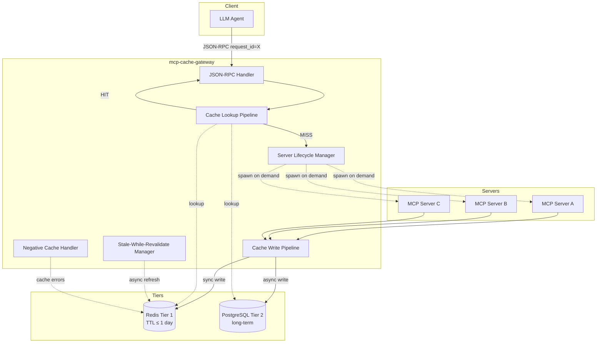
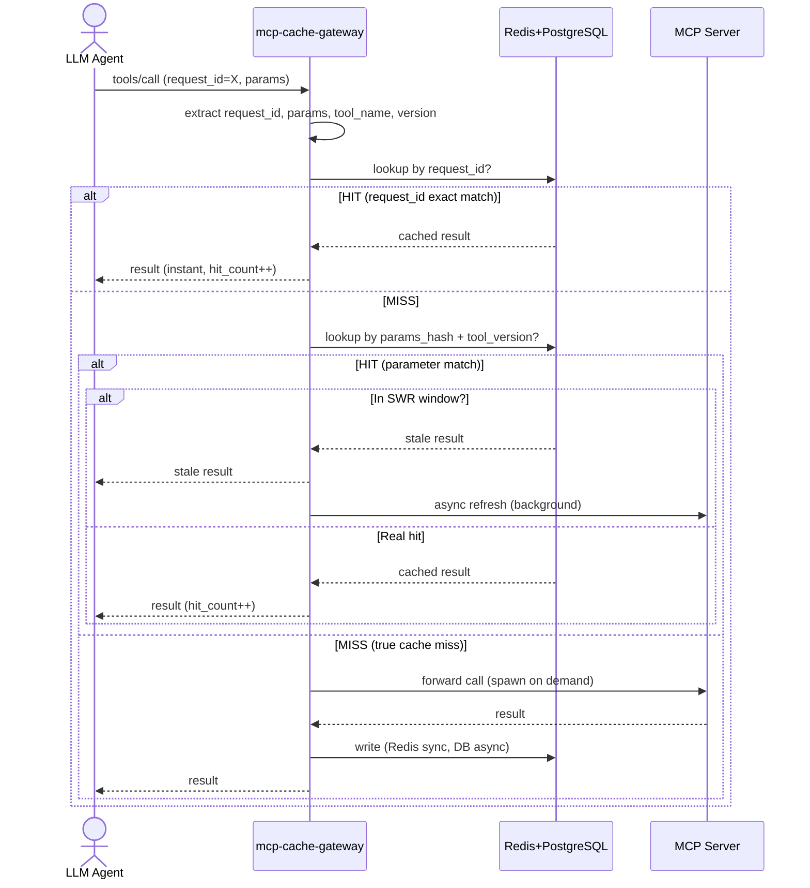
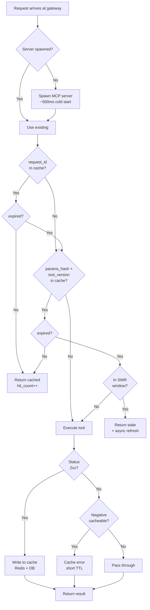
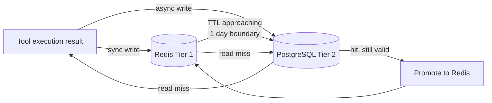
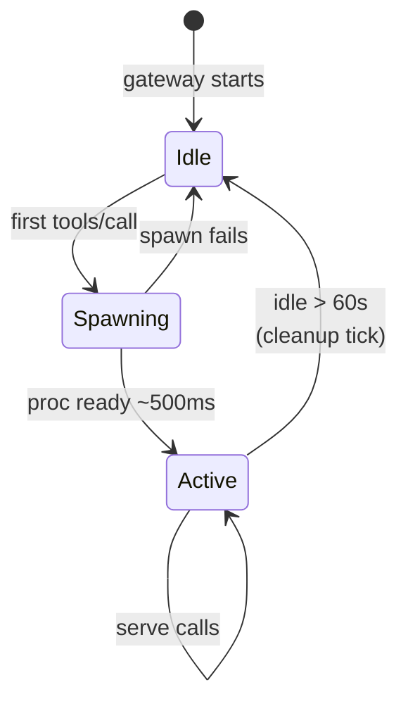

# MCP 服务器状态存储 + 多级缓存 · 完整设计文档（v1.0 草案）

> 创建：2026-08-08 智多星
> 状态：📝 草案 v1.0（待 fuermos 拍板）
> 输入需求：fuermos 2026-08-08 10:43 design request
> 关联文档：
> - `mcp-cache-design-2026-08-01.md`（**客户端**结果缓存，对齐 spec `ttlMs`+`cacheScope`）
> - `mcp-strategy-2026-07-09.md`（MCP 战略总览 + 现有 7 个 MCP）

---

## 0. 摘要（TL;DR）

| 维度 | 现状 | 新设计 |
|------|------|--------|
| **MCP server 状态** | 无状态（每次调用独立） | **有状态**（server 端持久化请求/响应/版本） |
| **请求关联** | JSON-RPC `id` 仅做 response 关联 | `request_id` **first-class**（贯穿缓存键/状态/通知） |
| **缓存位置** | 无（或客户端 LRU） | **两级**：Redis（≤1 天）+ DB（>1 天） |
| **缓存键** | 无 | `request_id` 优先 → fallback `hash(server, method, params)` |
| **TTL** | 无（或 spec `ttlMs` per-result） | **per-tool 持久化配置**（weather 5min / stocks 1min / 数学题 1day） |
| **时效性工具** | 无差别 | **explicit `timeSensitive: true` 标注 + TTL 配置** |
| **缓存作用域** | spec 默认 public，我保守 private | ✅ **`public`（主人 2026-08-08 10:49 拍板：不分用户）** |

**关键判断**：
- ✅ MCP 协议**支持**这套设计（不破坏 wire format，extension-only）
- ⚠️ 需要新增 spec 之外的 server-side 组件（建议名：`mcp-cache-gateway`，独立进程，sidecar 模式）
- 🎯 落地优先级：先做 Redis 一级 + DB 二级骨架 → per-tool TTL 配置 → 完整 idempotency
- 🌐 缓存作用域：**`public`（不分用户）**——高命中率 + 简化设计（无 user_id 字段）

---

## 1. MCP 协议分析（现状 · 2026-07-28 stable）

### 1.1 协议基础

MCP（Model Context Protocol，Anthropic 主导）= JSON-RPC 2.0 over 多 transport。

- **Wire format**：JSON-RPC 2.0（request / response / notification / batch）
- **官方规范**：`https://modelcontextprotocol.io/specification/...`
- **当前 stable**：2026-07-28
- **本机 GitHub mirror**：`https://github.com/modelcontextprotocol/modelcontextprotocol`

### 1.2 Transport（3 种）

| Transport | 状态 | 用途 |
|----------|------|------|
| **stdio** | ✅ 当前主流 | 本地子进程，单 client 单 server |
| **Streamable HTTP** | ✅ 新（替代 HTTP+SSE） | 跨网络，HTTP POST + SSE / chunked stream |
| **HTTP + SSE** | ⚠️ legacy deprecated | 旧 spec 兼容 |

**OpenClaw 现状**（`mcp-strategy §1`）：8 个 MCP 中 7 个 stdio + 1 个 SSE。**新设计对 stdio 和 HTTP transport 都适用**。

### 1.3 Method 清单（核心子集）

| Method | 方向 | 说明 |
|--------|------|------|
| `initialize` | C→S | 协议版本 + capabilities 协商 |
| `tools/list` | C→S | 列工具定义 |
| `tools/call` | C→S | 调用工具（**核心执行路径**） |
| `resources/list` | C→S | 列资源 |
| `resources/read` | C→S | 读资源 |
| `prompts/list`, `prompts/get` | C→S | 模板提示 |
| `notifications/*` | S→C | 推送（list_changed / progress / cancelled / message） |
| `ping` | C↔S | 健康检查 |
| `logging/setLevel` | C→S | 日志级别 |

### 1.4 Request ID 现状

JSON-RPC 2.0 原生：
- **request** 带 `id: string | number | null`
- **response** 用同 `id` 关联
- **notification** 不带 `id`（fire-and-forget）
- **client 生成**（server 不应该自己造）

⚠️ **当前限制**：`id` 只用于 response 关联，**不携带业务语义**。新设计要把它提升为 first-class（贯穿缓存 + 状态 + 审计）。

### 1.5 Capabilities + Versioning

- `initialize` 协商：protocol version（当前 `2026-07-28`）+ capabilities 双向声明
- Server 端 capability：`tools` / `resources` / `prompts` / `logging`
- Client 端 capability：`sampling` / `roots` / `experimental`
- **协议版本必须匹配**，否则 `initialize` 失败

### 1.6 缓存原语（2026-07-28 新增，SEP-2549）

- response 可携带 `ttlMs: number | null`
- response 可携带 `cacheScope: "private" | "public"`
- spec 路径：`/server/utilities/caching.md`
- 客户端可按 hint 决定是否缓存

⚠️ **本设计的区别**：spec `ttlMs` 是 **per-response 动态提示**，本设计是 **per-tool 持久化配置**。两者互补，不冲突。

### 1.7 MRTR（Multi-Round Tool Results, SEP-2322）

- 长任务分多轮：`resultType: "input_required"` / `"completed"`
- spec 路径：`/basic/patterns/mrtr.md`
- **重试请求**带 `inputResponses` / `requestState`，**MUST NOT 缓存**（spec 明文）

⚠️ **本设计兼容**：MRTR 中间结果自然 bypass 缓存（idempotency key 不会匹配）。

### 1.8 已弃用（SEP-2577）

- `Roots` / `Sampling` / `Logging`（除了 logging 仍作为 capability）
- spec 路径：`/deprecated.md`
- 本设计不涉及这些原语

### 1.9 关键 SEP 一览（跟我们关系）

| SEP | 内容 | 跟本设计关系 |
|-----|------|-------------|
| **SEP-2549** | TTL + cacheScope | ✅ 已有（per-response 提示），本设计 per-tool 持久化是补充 |
| **SEP-2322** | MRTR | ✅ 兼容（中间结果 bypass 缓存） |
| SEP-2575/2567/2243 | Streamable HTTP / Sessionless | 🟡 无关（transport 层） |
| SEP-1699 | SSE polling | 🟡 无关 |
| **SEP-2133/1686/2663** | Tasks extension | 🟢 长任务可走 Tasks，本设计 cache 是 Tasks 之前的快速路径 |
| SEP-1865 | MCP Apps | ❌ 无关（UI 扩展） |
| SEP-1613/2106 | JSON Schema 2020-12 | 🟡 schema 写法，本设计不冲突 |
| SEP-985 系列 | OAuth | ❌ 单用户场景无关 |

---

## 2. 可行性分析（主人问 "新设计是否支持"）

| 设计项 | MCP 原生支持 | 需要扩展 | 风险 |
|--------|-------------|----------|------|
| **request_id first-class** | ✅ `id` 已有字段 | 约定语义 + server 持久化 | 低 |
| **Server-side 状态存储** | ✅ spec 无禁止（stateless 是默认不是强制） | 实现层加 DB | 中（一致性问题） |
| **两级缓存（Redis + DB）** | ✅ spec 无禁止 | 新组件 `mcp-cache-gateway` | 中（运维复杂度 +1） |
| **Per-tool TTL 配置** | 🟡 spec 有 `ttlMs`（per-response） | 加 tool metadata 字段 | 低 |
| **Parameter matching cache** | ✅ spec 无禁止（idempotency 是 HTTP 通识） | 约定 key 规则 + 处理 params hash 冲突 | 中（参数规范化） |
| **Tool version 追踪** | 🟡 spec 无 | server 自报 version，存到 request metadata | 低 |
| **时效性工具特例（weather/stocks）** | 🟡 spec 无显式 | 加 `timeSensitive: true` annotation | 低 |

**结论**：✅ **全部支持**，不需要修改 MCP spec wire format。只需要：
1. 加 `mcp-cache-gateway`（sidecar，sidecar 模式）
2. 扩展 server 的 tool metadata 字段（`ttlMs` / `timeSensitive` / `version`）
3. 客户端约定 `request_id` 用法（透传 JSON-RPC `id` 即可，不发明新字段）

---

## 3. 提议设计：状态感知 MCP 服务器

### 3.1 架构图

```
┌──────────────────────────┐
│  MCP Client (LLM)        │
│  - 大模型每次带 request_id│
│  - 用 JSON-RPC `id` 字段 │
└────────────┬─────────────┘
             │ JSON-RPC + request_id
             ▼
┌─────────────────────────────────────────────────────────┐
│  MCP State-Cache-Aware Server (sidecar)                 │
│  ┌──────────────────────────────────────────────────┐  │
│  │ JSON-RPC Handler + Request ID context            │  │
│  └────────────────────┬─────────────────────────────┘  │
│                       ▼                                 │
│  ┌──────────────────────────────────────────────────┐  │
│  │ Cache Lookup Pipeline                            │  │
│  │   Step 1: lookup by request_id (exact)           │  │
│  │     HIT → return cached                          │  │
│  │   Step 2: lookup by hash(server, method, params)  │  │
│  │     HIT → return cached                          │  │
│  │   MISS → forward to actual tool impl             │  │
│  └────────────────────┬─────────────────────────────┘  │
│                       │ MISS                            │
│                       ▼                                 │
│  ┌──────────────────────────────────────────────────┐  │
│  │ Cache Write Pipeline                             │  │
│  │   - Write to Redis (TTL ≤ 1 day)                 │  │
│  │   - Async write to DB (TTL > 1 day)              │  │
│  │   - Index by request_id + params_hash            │  │
│  └──────────────────────────────────────────────────┘  │
└────────────┬────────────────────────────┬───────────────┘
             │                            │
             ▼                            ▼
   ┌──────────────────┐         ┌─────────────────────┐
   │ Redis            │         │ PostgreSQL/SQLite   │
   │ (热缓存, ≤1天)   │         │ (冷缓存, >1天)      │
   │ - 今日结果       │         │ - 持久化             │
   │ - 被唤醒的结果   │         │ - 完整审计           │
   └──────────────────┘         └─────────────────────┘
```

### 3.2 Request ID 语义升级

**现状**：`id` 仅做 response 关联。

**新约定**：
- Client 每次 `tools/call` 必须带稳定 `id`（建议 UUID v7，时间有序，便于审计）
- Server 把 `id` 写入 state + cache 键
- **同一 `id` 的重复请求**：返回首次响应（**idempotency by design**）
- **`id` 跨 session 持久**：client 重启后用同一 `id` 仍能命中缓存（避免重复扣费/调外部 API）

⚠️ **client 责任**：保证 `id` 全局唯一（不要用纯数字自增，会撞 id）。

### 3.3 状态存储 Schema（PostgreSQL）

```sql
CREATE TABLE mcp_request_state (
  request_id      TEXT PRIMARY KEY,        -- JSON-RPC id, client 生成
  server_id       TEXT NOT NULL,           -- MCP server 标识
  method          TEXT NOT NULL,           -- 'tools/call' / 'resources/read'
  tool_name       TEXT,                    -- 'get_weather' / 'fetch_stock'
  tool_version    TEXT,                    -- tool 自报 version
  params_hash     TEXT NOT NULL,           -- sha256(normalized_params)
  params_json     JSONB NOT NULL,
  result_json     JSONB,
  result_size     INTEGER,
  cache_tier      TEXT,                    -- 'redis' | 'db' | 'both'
  ttl_ms          INTEGER NOT NULL,        -- per-tool config
  expires_at      TIMESTAMPTZ NOT NULL,
  created_at      TIMESTAMPTZ DEFAULT NOW(),
  invalidated     BOOLEAN DEFAULT FALSE,
  hit_count       INTEGER DEFAULT 0,       -- 被命中次数
  metadata        JSONB                    -- 扩展：trace_id / session_id / user_id
);

CREATE INDEX idx_params_hash ON mcp_request_state (params_hash);
CREATE INDEX idx_expires_at_active ON mcp_request_state (expires_at) 
  WHERE NOT invalidated;
CREATE INDEX idx_tool_name ON mcp_request_state (tool_name);
CREATE INDEX idx_created_at ON mcp_request_state (created_at);

-- per-tool TTL 配置
CREATE TABLE mcp_tool_config (
  tool_name       TEXT PRIMARY KEY,
  tool_version    TEXT,
  ttl_ms          INTEGER NOT NULL,        -- 默认 86400000 (1 天)
  time_sensitive  BOOLEAN DEFAULT FALSE,   -- weather/stocks = true
  cacheable       BOOLEAN DEFAULT TRUE,    -- tools/call 默认 true
  max_param_size  INTEGER,                 -- params 超过此大小不缓存
  notes           TEXT
);
```

### 3.4 两级缓存策略

| 层级 | 存储 | 触发 | 保留期 | 用途 |
|------|------|------|--------|------|
| **Tier 1** | Redis | 每次写 | ≤ 1 天（TTL by tool） | 热点查询 / 当前 session 唤醒 |
| **Tier 2** | DB（PostgreSQL） | 异步写 | > 1 天（按 `expires_at`） | 冷数据 / 审计 / 跨 session 命中 |

**Promote / Demote 策略**（建议）：
- **写**：miss → 执行 → 同步写 Redis + 异步写 DB
- **读**：先 Redis，再 DB（DB hit 时可选 promote 回 Redis）
- **TTL 边界**：接近 1 天的条目从 Redis 删（让 DB 接管）
- **DB hit but Redis miss**：DB 拿到后**可选**回填 Redis（如果仍在 TTL 内）

### 3.5 Per-tool TTL 配置

**存储**：`mcp_tool_config` 表 + 服务启动时加载到内存。

**示例**：

| Tool | timeSensitive | ttlMs | 理由 |
|------|---------------|-------|------|
| `get_weather` | ✅ | 300_000（5min） | 天气分钟级变 |
| `fetch_stock_price` | ✅ | 60_000（1min） | 股价秒级变 |
| `solve_math_problem` | ❌ | 86_400_000（1天） | 数学题答案不变 |
| `search_papers` | ❌ | 3_600_000（1h） | 论文结果按天稳定 |
| `create_notebook` | ❌ | 0（不缓存） | 写操作，副作用 |

**配置加载**：
- Server 启动时 SELECT * FROM mcp_tool_config
- 运行时 reload：可监听 `notifications/config_changed`（自定义扩展）
- 配置示例 YAML：
  ```yaml
  tools:
    - name: get_weather
      version: "1.2.0"
      ttlMs: 300000
      timeSensitive: true
    - name: solve_math_problem
      version: "2.0.0"
      ttlMs: 86400000
      timeSensitive: false
  ```

### 3.6 Parameter Matching / Idempotency

**Key 算法**（无 user_id，跨用户共享）：
```
key = sha256(
  server_id + "|" + 
  method + "|" + 
  tool_name + "|" + 
  tool_version + "|" + 
  sha256(normalize(params))
)
```

**作用域**：所有 cache 条目 `cacheScope: "public"`（主人 2026-08-08 10:49 拍板：不分用户）。**隐私 caveat**：tool 作者负责标注 `cacheable: false` 当 result 含用户私有数据（notebook create / 写操作默认 false）。

**normalize(params)** 规则：
1. JSON canonicalize（sorted keys, no whitespace）
2. 移除**不影响结果的字段**（如 `trace_id`, `request_id`, `_meta`）
3. 转 UTC 时间戳到 ISO 8601

⚠️ **冲突处理**：
- 同一 key 不同结果 → 保留首次 + 标 `conflict=true` + 报警
- 不确定是否影响结果的字段 → 保守视为影响结果（不参与 normalize）

### 3.7 Tool Version 追踪

- Server 启动时声明每个 tool 的 `version`（metadata 字段）
- Cache key 包含 version → 升级后旧缓存自然失效
- DB 里 `tool_version` 字段用于审计 + 回溯

### 3.8 时效性工具特例（weather / stocks）

- 配置 `timeSensitive: true` + 短 TTL
- Server 端可**主动推送 invalidation**：
  - 股票价格突变 → server 发 `notifications/tools/invalidate` 带 tool_name
  - Weather alert → 同上
- Client 收到 invalidation → 清本地缓存（optional，本设计主要靠 server-side state）

---

## 4. 缓存键设计（核心）

### 4.1 查找顺序

```
Request arrives with id=X
  ↓
Step 1: SELECT * FROM mcp_request_state 
        WHERE request_id = X AND NOT invalidated AND expires_at > NOW()
  HIT → return result_json, increment hit_count
  MISS ↓
Step 2: SELECT * FROM mcp_request_state 
        WHERE params_hash = sha256(...) 
          AND tool_name = ... 
          AND tool_version = ... 
          AND NOT invalidated 
          AND expires_at > NOW()
        ORDER BY created_at DESC LIMIT 1
  HIT → return result_json, increment hit_count
  MISS ↓
Step 3: Execute tool, write to cache
```

### 4.2 何时匹配（cache hit）

- ✅ 同一 `request_id` 重试（网络抖动重发）
- ✅ 同一 `(server, method, tool, version, params)` 在 TTL 内
- ✅ MRTR 重试请求带 `inputResponses` → **必须带原 request_id**（spec 要求）

### 4.3 何时不匹配（cache miss / bypass）

- ❌ 不同 `request_id` 且 params 不同
- ❌ tool version 不同（升级后）
- ❌ TTL 已过
- ❌ MRTR 中间结果（`resultType: "input_required"`）
- ❌ 配置 `cacheable: false`（写操作）
- ❌ 配置 `timeSensitive: true` 且超过短 TTL
- ❌ params 超过 `max_param_size`（如超大文件）

---

## 5. 请求生命周期（完整流程）

```
1. Client 生成 request_id (UUID v7)
2. Client 发送 JSON-RPC request (id=request_id, method=tools/call, params={...})
3. State-cache-server 接收
4. 提取 request_id, method, tool_name, params
5. 计算 params_hash
6. Step 1: 查 request_id → HIT?  返回
7. Step 2: 查 params_hash → HIT?  返回 + hit_count++
8. Step 3: MISS → 转发给实际 MCP server (stdio subprocess 或 HTTP)
9. 收到 result
10. 查 mcp_tool_config 获取 TTL
11. 同步写 Redis: SETEX request_id ttl_ms result_json
12. 异步写 DB: INSERT INTO mcp_request_state ...
13. 返回 result 给 client
14. Server 端可发 notifications/tools/invalidate (optional, for time-sensitive tools)
```

---

## 6. 失效策略

### 6.1 主动失效（按优先级）

1. **TTL 到期**：基础机制，DB 用 `expires_at` 索引定期清理
2. **显式 invalidation**：server 发 `notifications/tools/invalidate`
3. **Tool version 变更**：自动 invalidate 旧 version 的所有缓存
4. **手动清空**：admin CLI / API（debug 用）

### 6.2 被动失效

- **LRU 内存压力**：Redis 满了自动驱逐（配置 `maxmemory-policy allkeys-lru`）
- **DB 定期 vacuum**：删除 `expires_at < NOW() - 7 days` 的记录（保留 7 天审计窗口）

### 6.3 一致性保证

- **Read-after-write**：client 刚发请求立即重试同一 `request_id` → 必中（DB 强一致）
- **跨 tier**：Redis hit 立即返回；DB hit 异步回填 Redis（最终一致，< 100ms）

---

## 7. OpenClaw 集成点

### 7.1 MCP Client 改造（OpenClaw 端）

- LLM 调用 MCP 时**自动生成 UUID v7** 作为 JSON-RPC `id`
- 重试逻辑用同 `id`（OpenClaw 已有 retry middleware）
- 不需要 client 改太多，主要是 `id` 生成策略

### 7.2 MCP Server 改造（每个 MCP）

- 工具声明加 metadata：
  ```jsonc
  {
    "name": "get_weather",
    "version": "1.2.0",
    "ttlMs": 300000,           // 新增字段
    "timeSensitive": true,     // 新增字段
    "cacheable": true,         // 新增字段（默认 true）
    "maxParamSize": 10240      // 新增字段
  }
  ```
- Server 在 `initialize` 时声明 capability `stateCache: true`（自定义扩展）

### 7.3 新组件：`mcp-cache-gateway`

**位置**：sidecar 进程（独立 Node.js / Python 服务）

**接口**：
- 接收 MCP JSON-RPC 请求（stdio 或 HTTP）
- 内部查 Redis + DB
- 转发到实际 MCP server

**OpenClaw MCP config 改造**：
```jsonc
// 之前：
{
  "chrome-devtools-mcp": {
    "command": "npx",
    "args": ["-y", "chrome-devtools-mcp@1.6.0", "--browserUrl", "..."]
  }
}

// 之后：
{
  "chrome-devtools-mcp": {
    "command": "node",
    "args": [
      "/path/to/mcp-cache-gateway.js",
      "--server-id", "chrome-devtools-mcp",
      "--tool-config", "/etc/openclaw/mcp-tool-config.yaml",
      "--redis-url", "redis://127.0.0.1:6379",
      "--db-url", "postgresql://localhost/mcp_state",
      "--", "npx", "-y", "chrome-devtools-mcp@1.6.0", "--browserUrl", "..."
    ]
  }
}
```

---

## 8. 风险与缓解

| 风险 | 影响 | 缓解 |
|------|------|------|
| **Cache stale（数据过期）** | 用户拿到旧结果 | per-tool TTL + invalidation；timeSensitive=true 工具 TTL 短 |
| **DB 写失败** | 数据不一致 | 异步写 + 失败重试 + 报警 |
| **Redis 挂了** | 退化为只走 DB | 自动 fallback，hit rate 下降但仍可用 |
| **params 规范化错误** | 该命中的没命中 / 不该命中的命中 | 严格测试 + conflict 检测 |
| **Redis 内存爆炸** | 服务崩溃 | `maxmemory-policy allkeys-lru` + maxEntries 限制 |
| **Cache 内容含敏感数据** | 数据泄漏 | `cacheScope: "private"` 默认 + Redis bind 127.0.0.1 |
| **MRTR 中间结果被缓存** | spec 违反 | Step 2 检查 `resultType: "input_required"` → bypass |
| **Tool version 字符串不一致** | 缓存不命中 | server 启动自检 + 启动失败报警 |
| **request_id 冲突** | 跨用户污染 | UUID v7（128 bit）冲突概率可忽略 |

---

## 9. 时间表 + 工作量估算

| 阶段 | 工作 | 估时 |
|------|------|------|
| **Phase 1** | `mcp-cache-gateway` 骨架（stdio + Redis + PostgreSQL） | 1 天 |
| **Phase 2** | Per-tool TTL 配置加载 + tool metadata 解析 | 半天 |
| **Phase 3** | Parameter matching / idempotency 单元测试 | 1 天 |
| **Phase 4** | 接入 1 个真实 MCP（如 `chrome-devtools-mcp`）做 e2e smoke | 半天 |
| **Phase 5** | DB schema 迁移 + Redis 部署文档 + OpenClaw MCP config 改造 | 半天 |
| **Phase 6** | notifications/tools/invalidate 扩展实现（time-sensitive tools） | 1 天 |
| **Phase 7** | 通用化（所有 8 个 MCP）+ wiki 文档 | 1 天 |
| **合计** | | **~5 个工作日** |

---

## 10. 待主人拍板（5 个 open question）

1. **DB 选型**？PostgreSQL（推荐，复用 tubi-memory 经验）vs SQLite（轻量）vs 其他？
2. **Redis 选型**？原生 Redis vs DragonflyDB（更高吞吐）？本机有 Redis 经验吗？
3. **Per-tool 配置存储**？DB 表 + 启动加载 vs YAML 文件 vs MCP server 自报 metadata？
4. ✅ ~~**多用户范围**？~~ **主人 2026-08-08 10:49 拍板：不分用户，`cacheScope: "public"`**
5. **MVP 范围**？先做 Phase 1-3（核心 + idempotency）→ smoke → 决定是否继续？还是一次做完 7 个 phase？

**额外 — Preflight**（主人 2026-08-08 10:54-10:56 已深挖）：
- ❌ **@frontmcp/plugin-cache** — 硬依赖 FrontMCP 框架，**不可复用**
- 🟡 **mcp-cache-proxy** (ZeroClue, MIT, v0.5.0) — **部分复用 ~50%**（transport / stats / SWR / negative cache / lazy load / CLI）
- 详细对比见 §12 Preflight findings

**决策项**（推荐 A 或 D）：
- **A. Fork + 扩展 mcp-cache-proxy** — 节省 2 天，~3 天 ship，维护中（upstream sync）
- **B. mcp-cache-proxy + 薄 idempotency wrapper** — 节省 2 天，~3.5 天 ship，维护低（两 tier / per-tool TTL 难加）
- **D. 自建 + 借鉴 best practices**（SWR / negative cache / lazy 算法） — ~4 天 ship，全控制，clean codebase
- **C. 完全自建**（按原计划） — ~5 天 ship

---

## 11. 下一步（建议）

- 等主人回复 §10 的 5 个 open question
- 答完后我出 Phase 1 的具体代码骨架（~200 行 Node.js）+ DB migration SQL + Redis 部署步骤
- 然后做 Phase 4 smoke test 验证

---

**作者**：智多星 🎯
**关联**：mcp-cache-design-2026-08-01.md（**客户端**层缓存，本设计是**服务端**层缓存，互补）
**版本**：v1.0 草案
---

## Appendix A: 流程图 (Mermaid · GitHub 原生渲染)

### A.1 架构总览 (Architecture Overview)



### A.2 请求生命周期 (Request Lifecycle · Sequence)



### A.3 缓存查找决策树 (Cache Lookup Decision Tree)



### A.4 两级缓存流转 (Two-tier Promotion Logic)



### A.5 Lazy Server Loading 生命周期


